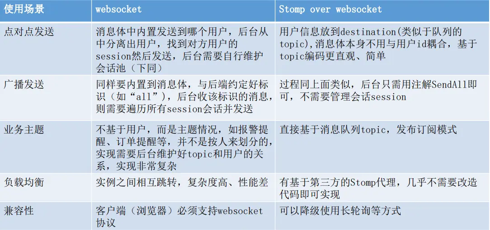
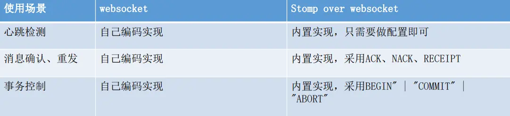
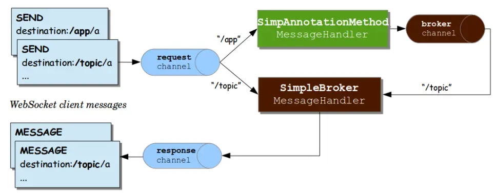
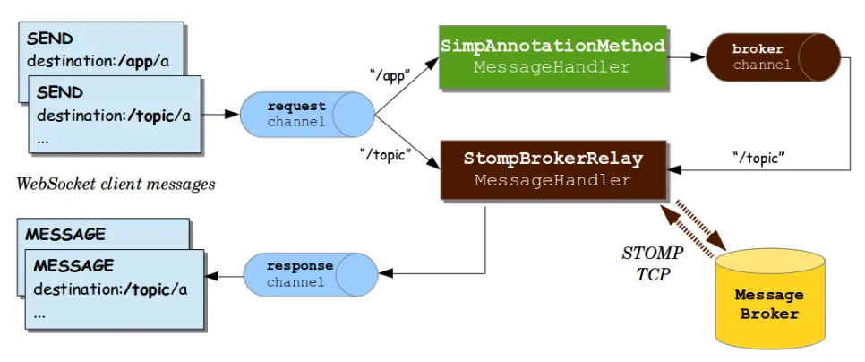

## STOMP
#### 定义
STOMP 中文为“面向消息的简单文本协议”，STOMP 提供了能够协作的报文格 式，以至于 STOMP 客户端可以与任何 STOMP 消息代理Brokers进行通信，从而为多语言，多平台和 Brokers 集群提供简单且普遍的消息协作。STOMP 协议可 以建立在 WebSocket 之上，也可以建立在其他应用层协议之上。通过 Websocket 建立 STOMP 连接，也就是说在 Websocket 连接的基础上再建立 STOMP 连接。

常见的 STOMP 的服务器/客户端的开源实现
* STOMP 服务器：ActiveMQ、RabbitMQ、StompServer、…
* STOMP 客户端库：stomp.js(javascript)、stomp.py(python)、Gozirra(java)、…

#### STOMP Over WebSocket
即 WebSocket 结合 Stomp 的实现。WebSocket 协议是基于 TCP 的一种新的网络协议，实现双工通讯，但是 websocket 没有规范payload （除控制信息外的有效载体）格式，可以是文本数据，也可以发送二进制数据，需要我们自己定义。而我们可以使用 stomp 协议去规范传输数据格式标准。

#### Stomp 帧格式示例
STOMP的客户端和服务器之间的通信是通过“帧”（Frame） 实现的，每个帧由多“行”（Line）组成。

* 第一行包含了命令，然后紧跟键值对形式的Header内容。
* 第二行必须是空行。
* 第三行开始就是Body内容，末尾都以空字符结尾。
```text
MESSAGE
message-id:nxahklf6-1
subscription:sub-1
destination:/topic/price.stock.MMM

{"ticker":"MMM","price":129.45}^@
```

#### STOMP Over WebSocket 优点



### 运行流程图
#### Stomp 本身

* channel：即客户端与服务端连接的通道
* /app：由程序配置定义的缀，这种前缀指该消息需要经过一些自定义处理（在Controller中）再发到 Stomp 代理（后续详解）
* /topic：同上，不过这类是不需要经过自定义处理的，直接发到 Stomp 代理（后续详解）

#### 结合其他消息中间件

* 即相对于上述增加了一步 Stomp 代理与消息中间件之间的交互。

#### SocketJs 是什么
SockJS 是一个浏览器的 JavaScript 库，它提供了一个类似于网络的对象，SockJS 提供了一个连贯的，跨浏览器的 JavaScriptAPI，它在浏览器和 Web 服务器之间创建了一个低延迟、全双工、跨域 通信通道。SockJS 的一大好处在于提供了浏览器兼容性。即优先使用原生 WebSocket，如果浏览器不支持 WebSocket，会自动降为轮询的方式。
